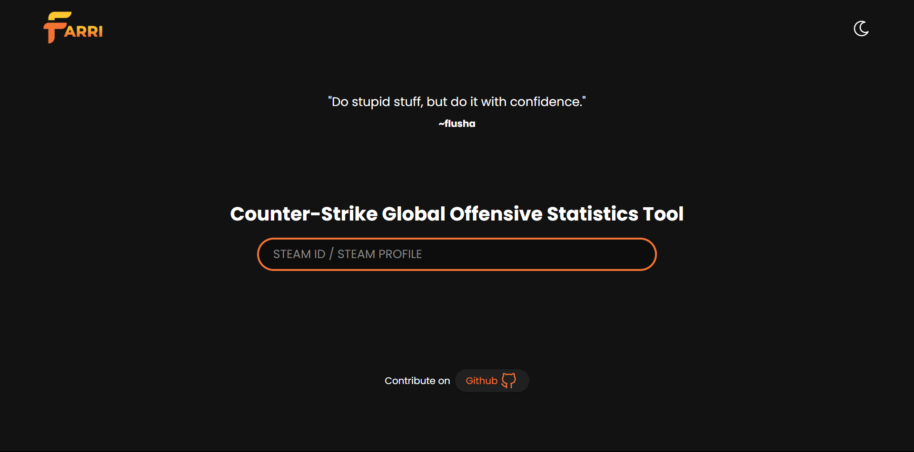
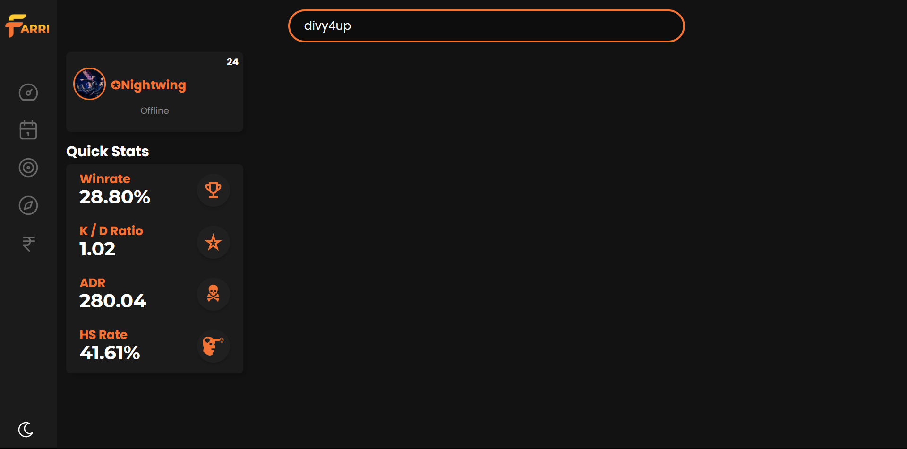

# client for `farri`

- Currently in Alpha and responsive for mobile users!

### Landing Page (dark mode)



### Profile Dashboard (for Steam ID `divy4up`)

- Sidebar expands on mouse hover. This is most recent alpha update, more content to come in future.



## Prerequisites

You need Node.js for `npm` package manager installed on your machine for this project.

NPM (Node Package Manager) is installed when you install Node.js

- [Install Node.js on your machine](https://nodejs.org/en/download/)

## Setup the project

The following command allow you to install all the dependencies needed in order to run the project on your machine exactly the way it is intended to.

```
npm install
```

## Compile and run the project for **development**

The following command allow you to compile the project and run the server to host your application with the **hot-reloads**.

_**Hot-Reload** is a feature that allows you to see the changes in your application without needing to restart or refresh._

```
npm start
```

## Compiles and minifies for **production**

The following command allow you to compile a production build which is optimized for deployment.
`

```
npm run build
```

## Format files

**I highly recommend installing [ESLint](https://eslint.org/) & [Prettier](https://prettier.io/) extensions for your text editor if available so that your code can formato, lint and fix linting errors(if possible) on save itself in one go. But if you wanna format, lint and fix linting errors manually using CLI then follow the below commands.**

The following command allow you to make sure there are no linting issues in the project files.

```
npm run format
```

## Lint files

The following command allow you to make sure there are no linting issues in the project files.

```
npm run lint
```

## Fix lint error

The following command allow you to make sure there are no linting issues in the project files.

```
npm run fix
```
